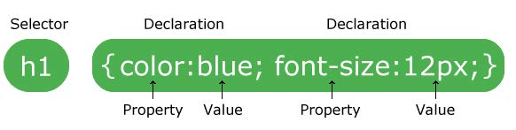
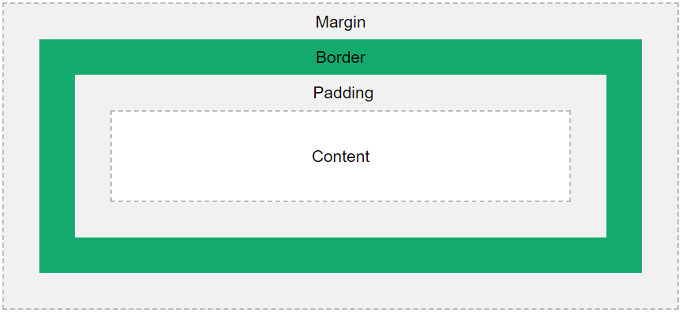

# CSS Estilos e Animações

A sintaxe do CSS é composta por um seletor e um bloco de declaração:

**Propriedades CSS**

Existem muitas propriedades CSS para modificar os elementos HTML de várias formas. Podemos resumi-las em 6 categorias:

- Tamanho: font-size, width, height, margin, padding etc;
- Cor: color, background-color etc;
- Variações: font-weight, text-decoration, shadow, border, cursor etc;
- Posicionamento: position, align, flex, grid, float etc;
- Conteúdo: background-image, content, @import, @media etc;
- Animação: animation, transform, transition etc.

 

**Modelo de Caixa CSS**

Todos os elementos HTML podem ser considerados caixas. Em CSS, o termo "modelo de caixa" é usado quando se fala em design e layout. Ele é essencialmente uma caixa que envolve todos os elementos HTML. Consiste em: margens, bordas, preenchimento e o conteúdo real. A imagem abaixo ilustra o modelo da caixa:

Explicação das diferentes partes:

- Content (Conteúdo) - o conteúdo da caixa, onde o texto e as imagens aparecem;
- Padding (Margem interna) - limpa uma área ao redor do conteúdo. O preenchimento é transparente;
- Border (Borda) - uma borda que circunda o preenchimento e o conteúdo;
- Margin (Margem externa) - limpa uma área fora da borda. A margem é transparente.

O modelo de caixa nos permite adicionar uma borda ao redor dos elementos e definir o espaço entre eles.

Para definir a largura (width) e a altura (height) de um elemento corretamente em todos os navegadores, precisamos saber como funciona o modelo de caixa. Importante ressaltar que, ao definir as propriedades de largura e altura de um elemento com CSS, nos apenas definimos a largura e a altura da área de conteúdo. Para calcular o tamanho total de um elemento, precisamos adicionar preenchimento, bordas e margens.

 

**Seletores**

Os seletores CSS são usados para "encontrar" (ou selecionar) os elementos HTML que desejamos estilizar. Podemos dividir os seletores CSS em cinco categorias:

- [**Seletores simples**](https://www.w3schools.com/css/css_selectors.asp): selecione os elementos com base no nome, id, classe;
- [**Seletores de combinação**](https://www.w3schools.com/css/css_combinators.asp): selecione os elementos com base em uma relação específica entre eles;
- [**Seletores de pseudo-classe**](https://www.w3schools.com/css/css_pseudo_classes.asp): selecione os elementos com base em um determinado estado;
- [**Seletores de pseudo-elementos**](https://www.w3schools.com/css/css_pseudo_elements.asp): selecione e estilize uma parte de um elemento;
- [**Seletores de atributo**](https://www.w3schools.com/css/css_attribute_selectors.asp): selecione os elementos com base em um atributo ou valor de atributo

 

**Funções **

As funções CSS são usadas como um valor para várias propriedades CSS. Abaixo veremos algumas das principais funções:

| Função                                                       | Descrição                                                    |
| ------------------------------------------------------------ | ------------------------------------------------------------ |
| [attr()](https://www.w3schools.com/cssref/func_attr.php)     | Retorna o valor de um atributo do elemento selecionado.      |
| [calc()](https://www.w3schools.com/cssref/func_calc.php)     | Permite que você execute cálculos para determinar os valores das propriedades CSS. |
| [conic-gradient()](https://www.w3schools.com/cssref/func_conic-gradient.php) | Cria um gradiente cônico                                     |
| [counter()](https://www.w3schools.com/cssref/func_counter.php) | Retorna o valor atual do contador nomeado                    |
| [cubic-bezier()](https://www.w3schools.com/cssref/func_cubic-bezier.php) | Define uma curva de Bézier cúbica.                           |
| [hsl()](https://www.w3schools.com/cssref/func_hsl.php)       | Define as cores usando o modelo Hue-Saturation-Lightness (HSL). |
| [hsla()](https://www.w3schools.com/cssref/func_hsla.php)     | Define cores usando o modelo Hue-Saturation-Lightness-Alpha (HSLA). |
| [linear-gradient()](https://www.w3schools.com/cssref/func_linear-gradient.php) | Define um gradiente linear como imagem de fundo. Defina pelo menos duas cores (de cima para baixo). |
| [max()](https://www.w3schools.com/cssref/func_max.php)       | Usa o maior valor, de uma lista de valores separados por vírgulas, como o valor da propriedade |
| [min()](https://www.w3schools.com/cssref/func_min.php)       | Usa o menor valor, de uma lista de valores separados por vírgulas, como o valor da propriedade |
| [radial-gradient()](https://www.w3schools.com/cssref/func_radial-gradient.php) | Define um gradiente radial como imagem de fundo. Defina pelo menos duas cores (centro para as bordas). |
| [repeating-conic-gradient()](https://www.w3schools.com/cssref/func_repeating-conic-gradient.php) | Repete um gradiente cônico                                   |
| [repeating-linear-gradient()](https://www.w3schools.com/cssref/func_repeating-linear-gradient.php) | Repete um gradiente linear.                                  |
| [repeating-radial-gradient()](https://www.w3schools.com/cssref/func_repeating-radial-gradient.php) | Repete um gradiente radial.                                  |
| [rgb()](https://www.w3schools.com/cssref/func_rgb.php)       | Define cores usando o modelo Red-Green-Blue (RGB).           |
| [rgba()](https://www.w3schools.com/cssref/func_rgba.php)     | Define cores usando o modelo Red-Green-Blue-Alpha (RGBA).    |
| [var()](https://www.w3schools.com/cssref/func_var.php)       | Insere o valor de uma propriedade personalizada.             |

---

### CSS Pseudo

São atributos especiais que são adicionados aos elementos dependendo de uma ação ou de uma condição específica. 

Existem 3 tipos de “pseudo” em CSS:

- [**Pseudo-classes**](https://www.w3schools.com/css/css_pseudo_classes.asp) é usada para definir um estado especial de certo elemento;
- [**Pseudo-seletor**](https://www.w3schools.com/css/css_pseudo_classes.asp) (que faz parte das pseudo-classes) é usado para modificar um elemento especificado que está em determinada posição (filho) de outro elemento;
- [**Pseudo-elementos**](https://www.w3schools.com/css/css_pseudo_elements.asp) é usado para estilizar partes específicas de um elemento.

---

###   CSS Animações

Uma animação permite que um elemento mude gradualmente de um estilo para outro. Podemos alterar quantas propriedades CSS quisermos, quantas vezes quiser. As animações são muito usadas com o CSS transform.

**CSS Transform**

É possível animar os elementos de diversas formas e um atributo muito usado é o CSS transform, que permite mover, girar, redimensionar e inclinar elementos. Resumo das propriedades:

| Propriedade         | Descrição                                                    |
| ------------------- | ------------------------------------------------------------ |
| translate(x,y)      | Define uma translação 2D, movendo o elemento ao longo dos eixos X e Y. |
| translateX(x)       | Define uma tradução 2D, movendo o elemento ao longo do eixo X. |
| translateY(y)       | Define uma tradução 2D, movendo o elemento ao longo do eixo Y. |
| rotate(angle)       | Define uma rotação 2D, o ângulo é especificado no parâmetro. |
| scale(x,y)          | Define uma transformação de escala 2D, alterando a largura e altura dos elementos. |
| scaleX(x)           | Define uma transformação de escala 2D, alterando a largura do elemento. |
| scaleY(x)           | Define uma transformação de escala 2D, alterando a altura do elemento. |
| skew(x,y)           | Define uma transformação de inclinação 2D ao longo dos eixos X e Y. |
| skewX()             | Define uma transformação de inclinação 2D ao longo do eixo X. |
| skewY()             | Define uma transformação de inclinação 2D ao longo do eixo Y. |
| matrix(n,n,n,n,n,n) | Define uma transformação 2D, usando uma matriz de seis valores. |

**CSS Animation**

Para usar o CSS animation, primeiro devemos especificar alguns quadros-chave `@keyframes` para a animação. Os keyframes contêm os estilos que o elemento terá em determinados momentos. Para fazer uma animação funcionar, devemos vincular a animação a um elemento adicionando as seguintes propriedades:

- [**animation-name** (nome da animação)](https://www.w3schools.com/cssref/css3_pr_animation-name.asp): Deve ser adicionado ao elemento que fará a animação;
- [**animation-duration** (duração da animação)](https://www.w3schools.com/cssref/css3_pr_animation-duration.asp): Se ela não for especificada, a animação não funciona. A duração pode ser em segundos, milisegundos, porcentagem;
- [**animation-timing-function** (opcional)](https://www.w3schools.com/cssref/css3_pr_animation-timing-function.asp): estabelece curvas de aceleração predefinidas, como ease ou linear;
- [**animation-delay** (opcional)](https://www.w3schools.com/cssref/css3_pr_animation-delay.asp): o tempo entre o elemento sendo carregado e o início da sequência de animação. Valores negativos também são permitidos, e se usar valores negativos, a animação começará como se já tivesse sido reproduzida por X segundos;
- [**animation-direction** (opcional)](https://www.w3schools.com/cssref/css3_pr_animation-direction.asp): define se uma animação deve ser reproduzida para frente, para trás ou em ciclos alternados;
- [**animation-iteration-count** (opcional)](https://www.w3schools.com/cssref/css3_pr_animation-iteration-count.asp): o número de vezes que a animação deve ser executada. É possível usar o valor infinite para fazer a animação continuar para sempre;
- [**animation-fill-mode** (opcional)](https://www.w3schools.com/cssref/css3_pr_animation-fill-mode.asp): essa propriedade especifica um estilo para o elemento de destino quando a animação não está sendo reproduzida (antes de começar, depois de terminar ou ambos);
- [**animation-play-state** (opcional)](https://www.w3schools.com/cssref/css3_pr_animation-play-state.asp): pausa/reproduz a animação.

As animações também podem ser escritas de forma abreviada com as seguintes propriedades: `animation-name`, `animation-duration`, `animation-timing-function`, `animation-delay`, `animation-iteration-count` e `animation-direction`.
