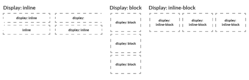
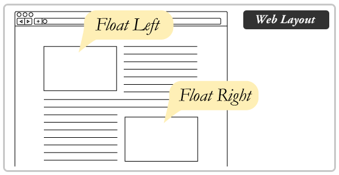
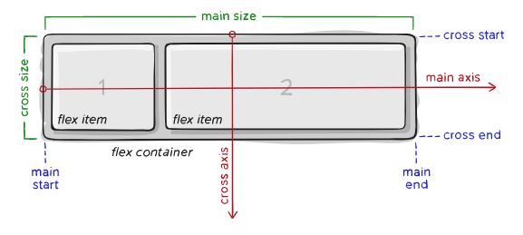
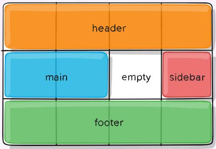

# CSS Layout

### Layout padrão

As técnicas de layout de página CSS nos permitem pegar os elementos contidos em uma página da web e controlar onde eles são posicionados.

#### Fluxo normal CSS

- Elementos em bloco **display: block**:
  - Os elementos aparecem empilhados uns sobre os outros;
  - O conteúdo de um elemento de nível de bloco é 100% da largura de seu elemento pai e tem a mesma altura de seu conteúdo.
- Elementos em linha **display: inline**:
  - Os elementos aparecem um ao lado do outro;
  - conteúdo de um elemento de nível de linha tem a mesma altura e largura de seu conteúdo.
- Elementos em bloco e linha (display: inline-block):
  - É a junção dos comportamentos dos valores inline + block: é possível definir uma largura (width) e altura (height) como no display: block e é possível deixar um elemento do lado do outro, da mesma forma que fazemos com o display: inline.

#### Os primórdios do layout web

**Layout de tabela**

Antes mesmo de CSS básico ser suportado de forma confiável em navegadores, os desenvolvedores web também costumavam usar tabelas para layouts de páginas da web inteiras, colocando seus cabeçalhos, rodapés, colunas em várias linhas e colunas da tabela.

Problemas ao usar o layout de tabela: são inflexíveis, muito pesados na marcação, difíceis de depurar e semanticamente errados (por exemplo, usuários de leitores de tela têm problemas para navegar nos layouts de tabelas).

 

[**Float**](https://css-tricks.com/almanac/properties/f/float/)

Float tem sido comumente usado para criar layouts de sites inteiros com várias colunas de informações flutuantes para que fiquem lado a lado. A manipulação dos elementos com float é comumente usado junto com elementos de margem, borda, altura/largura etc.

---

### [CSS Flexbox](https://css-tricks.com/snippets/css/a-guide-to-flexbox/)

O módulo Flexbox Layout (Caixa Flexível) visa fornecer uma forma mais eficiente de dispor, alinhar e distribuir o espaço entre os itens em um contêiner, mesmo quando seu tamanho é desconhecido e/ou dinâmico (daí a palavra“flex”).

Características:

- Foco no fluxo de conteúdo;
- Usado para projetar layouts unidimensionais simplificados, com uma disposição em linha reta;
- Define propriedades para o pai (contêiner) e seus filhos (itens);
- É mais indicado para os componentes de aplicativos e layouts em pequena escala.

---

###   [CSS Grid](https://css-tricks.com/snippets/css/complete-guide-grid/)

CSS Grid Layout (também conhecido como “Grid”), é um sistema de layout bidimensional, baseado em grade, que visa nada menos do que mudar completamente a maneira como projetamos interfaces de usuário baseadas em grade.

Características:

- Foco na posição de conteúdo;
- Usado para criação de layouts bidimensionais de complexidade maior;
- Define propriedades para linhas e colunas, como uma tabela;
- É ideal para organizar a estrutura de um esquema com elementos de nível mais elevado, como cabeçalhos, rodapés, seções e sidebar.

