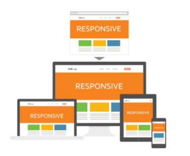
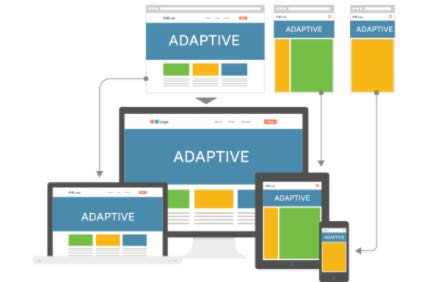

# Design Responsivo

Durante a elaboração de um projeto, é importante pensar na responsividade da aplicação para diferentes dispositivos. Existem dois padrões que normalmente são usados: o Responsive Design e o Adaptive Design.

### Responsive Design

Responsive Design (ou Design Responsivo) é fluido e se adapta ao tamanho da tela, independentemente do dispositivo de destino. Esse padrão usa media queries CSS para alterar estilos com base no dispositivo de destino, como tipo de exibição, largura, altura etc., e apenas um deles é necessário para que o site se adapte às telas diferentes.

O design responsivo não oferece tanto controle quanto o adaptativo, mas exige muito menos trabalho para construir e manter. Os layouts responsivos também são fluidos e, embora os adaptativos possam usar, e usam, porcentagens para dar uma sensação mais fluida ao dimensionar, eles podem, novamente, causar um salto quando uma janela é redimensionada.

### Adaptive Design

Adaptive Design (ou design adaptável) usa layouts estáticos baseados em pontos de interrupção que não respondem, uma vez que são carregados inicialmente. Adaptive funciona para detectar o tamanho da tela e carregar o layout apropriado para ele – geralmente é projetado um site adaptável para seis larguras de tela comuns:

- 320
- 480
- 760
- 960
- 1200
- 1600

Este design é útil para adaptar um site existente a fim de torná-lo mais compatível com dispositivos móveis. Isso permite que você controle o design e desenvolva para viewports múltiplas e específicas. O número de viewports que será usado para programar as páginas depende inteiramente do programador. No entanto, ele oferece um certo controle (por exemplo, sobre o conteúdo e o layout) que não existe necessariamente com o design responsivo.

### Responsive vs Adaptive Design

À primeira vista, parece que o adaptativo requer mais trabalho, pois você precisa projetar layouts para no mínimo seis larguras. No entanto, responsivo pode ser mais complexo, pois o uso indevido de consultas de mídia (ou mesmo não as usar) pode causar problemas de exibição e desempenho. O design responsivo é geralmente a técnica preferida apenas por causa do trabalho contínuo que o design adaptativo exige.

Responsive design é mais usado por ser mais rápido em desenvolvimento e manutenção, mas Adaptive design é mais performático e tem uma melhor usabilidade em geral. Afinal, a escolha vai depender do orçamento do projeto e para quem o projeto é destinado (audiência).
