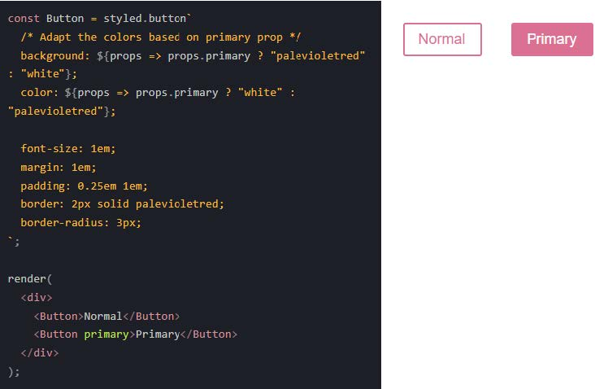

# CSS Pré-processadores e CSS-in-JS

### Introdução a pré-processadores

Pré-processadores são interpretadores de código, onde uma sintaxe é convertida para outra sintaxe (SCSS para CSS, por exemplo).

**Vantagens:**

- É possível usar recursos que ainda não existem no CSS (variáveis, nesting, mixins, herança etc.);
- Facilitam a manutenção do código, fazendo um código mais limpo;
- Faz os códigos CSS mais flexíveis e reutilizáveis;
- Ajuda a evitar a duplicação de código.

Existem muitos pré-processadores (SASS, LESS, Stylus etc.) e todos fazem praticamente as mesmas coisas. Aqui vamos estudar o SASS, pois é o mais usado atualmente pelos desenvolvedores.

#### [SASS](https://sass-lang.com/guide)

SASS (Syntactically Awesome Stylesheets, ou em português Folhas de Estilo Sintaticamente Impressionantes) é um pré-processador que estende e dá mais poder ao que conhecemos do CSS básico.

**Informações:**

- Escrito originalmente em Ruby;
- Linguagens para programar com SASS: .sass e .scss;
- Instalação:
  - NPM: npm install -g sass;
  - Homebrew: brew install sass/sass/sass.
- Comando para processar sass em css (terminal):
  - sass --watch input.scss output.css.

**Funcionalidades:**

1. [Variáveis](https://www.w3schools.com/sass/sass_variables.php): uma maneira de armazenar informações (qualquer valor CSS) que você deseja reutilizar em toda a sua folha de estilo.

   

2. [Aninhamento (nesting)](https://www.w3schools.com/sass/sass_nesting.php): aninhar os seletores de CSS de uma forma que siga a mesma hierarquia visual de seu HTML.

   

3. [Modules](): criar arquivos SASS parciais que contêm pequenos trechos de CSS que você pode incluir em outros arquivos SASS como módulos.

   

4. [Mixing](https://www.w3schools.com/sass/sass_mixin_include.php): fazer grupos de declarações CSS que podem ser reutilizados em todo o site.

   

5. [Estender/Herança](https://www.w3schools.com/sass/sass_extend.php): usar @extend permite compartilhar um conjunto de propriedades CSS de um seletor para outro.

   

   

   

6. [Operadores](https://www.w3schools.com/sass/sass_functions_numeric.php): operações matemáticas básicas.

 

**Outros pré-processadores**

- Leaner Style Sheets (LESS):
  - Inspirou-se no SASS e usa a extensão .less;
  - Foi escrito em JavaScript (SASS foi em Ruby);
  - Usa @ para declarar variáveis (SASS usa $);
  - Sintaxe de aninhamento igual ao SASS;
  - Usa .nomeMixin() para definir e usar mixins;
  - Mensagens de erro e documentação melhores em comparação ao SASS.
- Stylus:
  - Usa a extensão .styl;
  - Foi escrito em JavaScript (SASS foi em Ruby);
  - Declara a variáveis como quiser e atribui usando = (SASS usa $ no início);
  - Sintaxe de aninhamento igual ao SASS;
  - Usa .nomeMixin() para definir e usar mixins igual o LESS.

---

###   CSS-in-JS e Styled Components

Conceito onde trazemos o CSS para dentro do JavaScript, pensando em modularizar esse CSS em nível de componentes e não mais em nível de documentos.

Ele busca resolver:

- Falta de módulos do CSS para ocultar implementações;
- Falta de escopo devido ao único namespace global por documento;
- Dependências implícitas geradas por seletores que aplicam a vários elementos;
- Código CSS morto e cheio de colisões (classes duplicadas);
- Complexidade na especificidade de seletores.

**Vantagens de se usar CSS-in-JS**

- CSS Crítico Automático: Os componentes são renderizados e injetam automaticamente apenas seus estilos. Combinado com o code splitting, ajuda no carregamento de uma menor quantidade de código para o usuário final.
- Sem colisão de classes: Esse é um dos maiores problemas do CSS, e styled-components fornece nomes de classes a prova de colisão (classes duplicadas).
- Remoção de CSS: Como funciona diretamente nos componentes, ele consegue analisar quais códigos serão, inclusive os que são adicionados após interação do usuário, o que também ajuda a diminuir o código final.
- Estilo dinâmico simples: É possível criar estilos dinâmicos de forma fácil e intuitiva adaptando os estilos baseando nas props recebidas.
- Manutenção sem dor: O que você precisa estará no próprio contexto do componente, facilitando o desenvolvimento.
- Vendor prefixing automático: Escrevendo seu CSS no melhor padrão do mercado, os componentes cuidam para fornecer suporte aos browsers antigos.

**Styled Components**

Usa tagged template literals para estilizar seus componentes. Muito usado junto com React para estilizar componentes, mas também funciona bem com VueJS e outros. Este exemplo cria dois componentes simples, um wrapper e um título, com alguns estilos anexados a ele:

Adaptar componentes com base em props.

Estender estilos.

Estilizar qualquer componente.

Passar props.

