# UI e UX Design

###  Noções de UI e UX

UX (user experience) Design é o processo de projetar produtos físicos ou digitais que são úteis, fáceis de usar e oferecem uma ótima experiência na interação com eles. No processo de criação de um produto, o UX Designer deve passar por várias etapas:

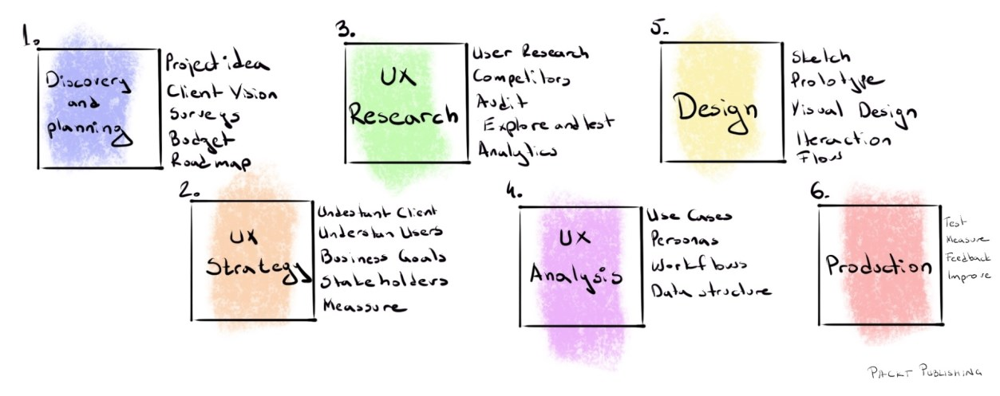

1. **Descoberta e Planejamento:** é o primeiro estágio do processo de UX, onde primeiro tocamos/discutimos a ideia por trás de nosso produto. O objetivo dessa etapa é que a equipe tenha uma ideia clara sobre o produto que irá projetar e desenvolver. Discutimos a ideia do projeto e a visão do cliente, fazemos entrevistas, analisamos o orçamento e desenhamos o roteiro.
2. **Estratégia UX**: é aqui que as equipes realizam pesquisas profundas relacionadas à ideia que foi fornecida por um cliente para criar a que queremos construir para nós mesmos. Nessa fase é onde entendemos o cliente, os competidores, os usuários, os objetivos do negócio, os stakeholders e fazemos medições.
3. **Pesquisa UX: concentra-se em entender o produto em si, o comportamento do usuário com o ele, suas necessidades, dores e motivações para usar nossos produtos. Nessa etapa são realizadas pesquisas, a exploração do problema, testes e revisão do que foi feito.
4. **Análise UX**: é nessa etapa que medimos a interação entre um usuário e a interface do usuário; muitas vezes, neste caso, pode ser um aplicativo, um produto digital ou até mesmo o próprio design. É onde são feitas análises de caso de uso, as personas e a estrutura de dados.
5. **Design**: é nessa etapa que desenvolvemos o design do produto em si. Aqui são feitos os modelos no Sketch, a prototipagem, o design visual e os fluxos de interação.
6. **Produção**: é nessa etapa, que pode começar com o design do processo de UX, especialmente quando o desenvolvimento do o produto se inicia, já que é a fase em que começa a dar feedback sobre um produto, que podemos ver, tocar e sentir visualmente. Nela são feitos testes, medições, feedback e aperfeiçoamento do produto.

Para alcançar essa ótima experiência, Peter Morville desenvolveu a ferramenta UX Honeycomb, que explica as várias facetas do UX design:

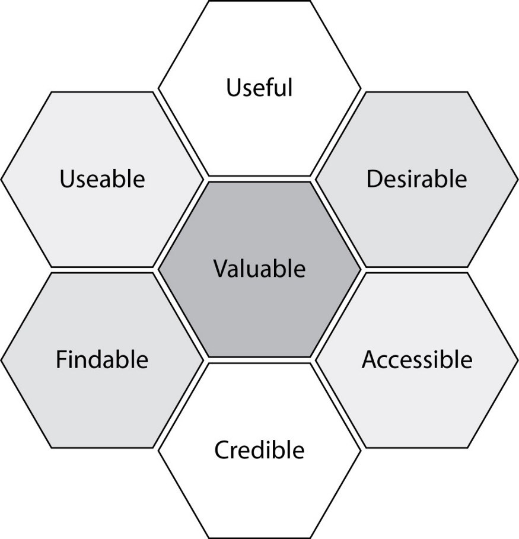

Cada faceta do UX design pode ser definida por este diagrama como:

- **Utilizável (usable)**: o sistema no qual o produto ou serviço é entregue deve ser simples e fácil de usar. Os sistemas devem ser projetados de forma familiar e fácil de entender. A curva de aprendizado pela qual um usuário deve passar deve ser a mais curta e indolor possível.
- **Útil (useful)**: o produto ou serviço de uma empresa precisa ser útil e preencher uma necessidade. Se o produto ou serviço não for útil ou atender aos desejos ou necessidades do usuário, não há um propósito real para o produto em si.
- **Desejável (desirable)**: a estética visual do produto, serviço ou sistema precisa ser atraente e fácil de traduzir. O design deve ser mínimo e direto ao ponto.
- **Localizável (findable)**: as informações precisam ser localizáveis e fáceis de navegar. Se o usuário tiver um problema, ele deve ser capaz de encontrar uma solução rapidamente. A estrutura de navegação também deve ser configurada de forma que faça sentido.
- **Acessível (accessible)**: o produto ou serviços devem ser projetados de forma que até mesmo pessoas com deficiência possam ter a mesma experiência de usuário que os outros.
- **Credível (credible)**: a empresa e seus produtos ou serviços precisam ser confiáveis.

A partir dessas várias facetas é que temos o valor do produto, ou seja, uma ótima experiência do usuário.

UI, por outro lado, é a parte em que projetamos interfaces de usuário para diferentes softwares de computador, aplicativos móveis, videogames e até mesmo para máquinas diferentes, como uma interface ATM, de máquina de lavar, de telas de carro ou qualquer interface física e digital que nosso usuário tenha que interagir. É nela onde projetamos algo mais direcionado para o produto em si, por exemplo: a forma dos botões, os campos de formulário, etc.

As interfaces do usuário (user interface) são os pontos de acesso onde os usuários interagem com os designs. Eles vêm em três formatos:

- **Interfaces gráficas do usuário (GUIs)** - os usuários interagem com representações visuais em painéis de controle digital. A área de trabalho de um computador é uma GUI.
- **Interfaces controladas por voz (VUIs)** - os usuários interagem com elas por meio de suas vozes. A maioria dos assistentes inteligentes - por exemplo, Siri no iPhone e Alexa nos dispositivos Amazon - são VUIs.
- **Interfaces baseadas em gestos** - os usuários se envolvem com espaços de design 3D por meio de movimentos corporais: por exemplo, em jogos de realidade virtual (VR).

A grande diferença entre UI e UX é que UX analisa a experiência geral do produto, enquanto a UI se concentra mais na aparência, como fontes, cores, botões, layout e espaços. Observe o exemplo abaixo:

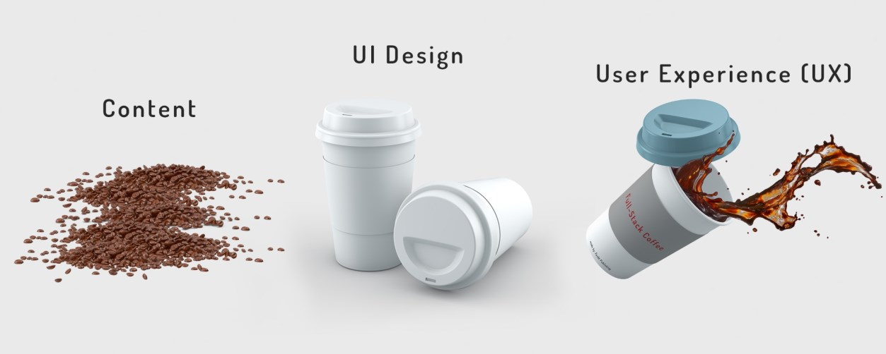

Para ter bons resultados na implementação da UI ao lado do front-end, deve haver uma grande colaboração entre a equipe de design e a equipe de front-end. Obter insights sobre o produto desde os estágios iniciais dará aos desenvolvedores front-end tempo para pesquisar diferentes tipos de estruturas que eles podem usar durante o processo de desenvolvimento, como Bootstrap, Bulma, Tailwind, Material Design ou Foundation. Eles também podem preparar facilmente o espaço de trabalho para esse momento ao decidir sobre diferentes ferramentas, como CSS, pré-processadores, como SASS ou LESS, ferramentas de automação, como gulp ou grunt, e até mesmo frameworks JavaScript, como Angular, React ou Vue.

**Design Systems**

De acordo com HACQ (2019), Design Systems “é a única fonte de verdade que agrupa todos os elementos que permitirão às equipes projetar, realizar e desenvolver um produto” (tradução livre). Ele é um documento vivo que possui todos componentes de UI e padrões visuais de uma empresa, marca, produto ou experiência. Um bom design system é o que vai unir a identidade do produto com os princípios da empresa, as melhores práticas de usabilidade e acessibilidade para construir componentes e padrões visuais que atendam aos usuários.

Mais que padrões visuais, o Design System expressa também a mensagem que a empresa ou produto quer passar para seu usuário final, e serve para facilitar a comunicação com os diferentes times (desenvolvimento, design, produto etc.). É um documento muito importante para manter a consistência visual e a experiência de uso como um todo, e isso fica fácil tendo os padrões bem definidos.

Com o Design System, os desenvolvedores são capazes de entender qual sistema de grid foi usado no estágio de design sendo então mais fácil para eles decidirem se devem ir com alguns frameworks prontos, como Bootstrap, ou criar algo novo do zero. Além disso, o Design System também dará aos desenvolvedores mais insights, fazendo-os entender quais tipos de componentes de UI serão incluídos na interface do usuário, por exemplo, qualquer componente exclusivo em comparação com os padrões (botões, entradas, formulários, guias e assim por diante), qualquer layout exclusivo ou se há componentes de design extras para os próximos recursos.

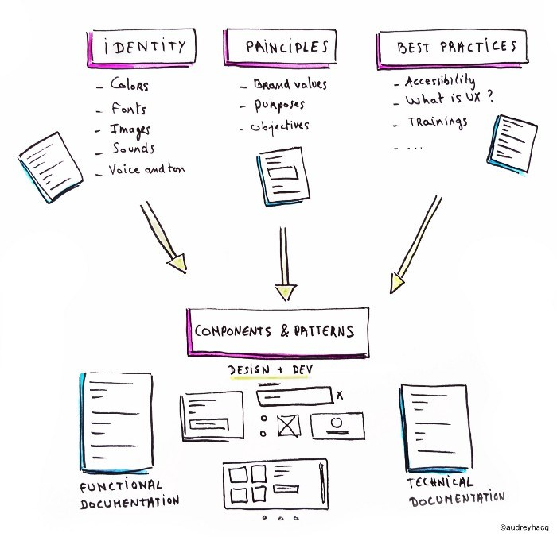

Não existe uma estrutura padrão em relação ao que um Design Systems deve ter, isso depende da necessidade da equipe e do tipo de projeto. De uma forma geral, um Design Systems possui a seguinte estrutura:

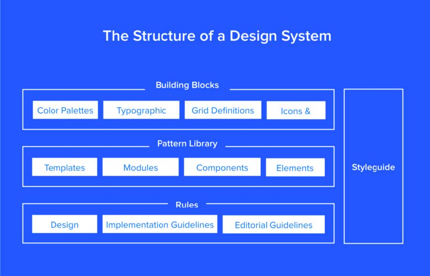

Como é possível ver pela imagem, a estrutura é dividida em 4 grandes blocos:

- **Blocos de construção (building blocks)**: é onde se encontra a paleta de cor, a tipografia, definição de grid, iconografia etc. Ou seja, é o bloco onde são definidos os padrões básicos de design.
- **Biblioteca de Padrões (Pattern Library):** é uma “subclasse no sistema de design, é o conjunto de padrões de design para uso em uma empresa” (SERRADAS, 2018). Ou seja, é onde se encontram os templates, módulos, componentes e elementos que serão usados por padrão. Essa parte pode ser construída apenas a parte visual ou já ter os códigos de cada elemento para implementação.
- **Regras (rules):** onde se encontram as regras de design, diretrizes de implementação e diretrizes editoriais. Ou seja, é onde são definidos as regras de o que deve ser implementado, onde e de qual forma.
- **Guia de estilos (style guide)**: é “uma documentação que descreve o próprio sistema de design: como os produtos devem parecer e se comportar, padrões de interface do usuário como tamanho de fonte, cores, botões e etc.” (SERRADAS, 2018).

Muitas empresas possuem seu Design System disponível para o público, abaixo estão alguns exemplos para se ter como referência:

- [Material Design](https://m3.material.io/)
- [Atlassian](https://atlassian.design/)
- [Polaris](https://polaris.shopify.com/)

---

### Atomic Design

O design atômico é uma metodologia composta por cinco estágios distintos trabalhando juntos para criar sistemas de design de interface de uma maneira mais deliberada e hierárquica. Os cinco estágios do projeto atômico são:

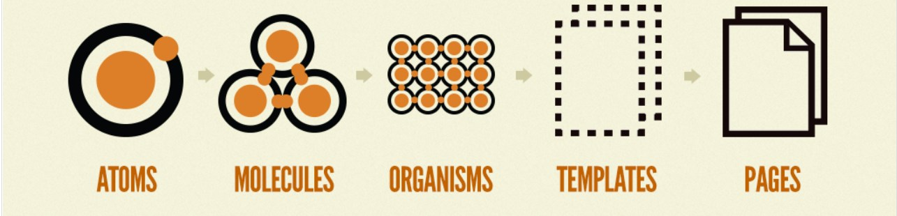

1. **Átomos**: servem como blocos de construção básicos que abrangem todas as nossas interfaces de usuário. Eles incluem elementos HTML básicos, como rótulos de formulários, entradas, botões e outros que não podem ser divididos, mas sem deixar de ser funcionais.

2. **Moléculas**: são grupos relativamente simples de elementos de UI funcionando juntos como uma unidade. Por exemplo, um rótulo de formulário, entrada de pesquisa e botão podem ser unidos para criar uma molécula de formulário de pesquisa.

   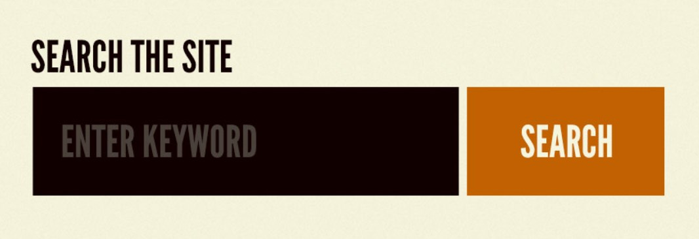

3. **Organismos**: são componentes UI relativamente complexos compostos por grupos de moléculas e/ou átomos e/ou outros organismos. Esses organismos formam seções distintas de uma interface.

   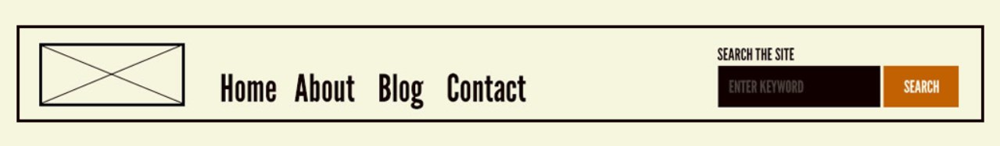

   Enquanto alguns organismos podem consistir em diferentes tipos de moléculas, outros organismos podem consistir na mesma molécula repetida continuamente. Por exemplo, em uma loja de roupas, podemos ter vários módulos de produtos dentro de um organismo.

4. **Modelos (templates)**: são objetos de nível de página que colocam componentes em um layout e articulam a estrutura de conteúdo subjacente do design.

   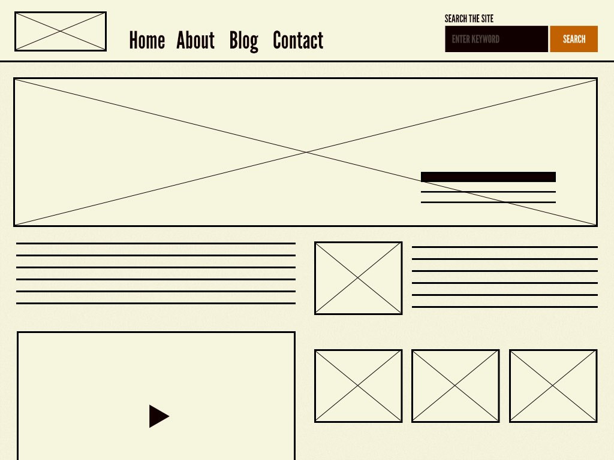

   Esse modelo de página inicial exibe todos os componentes de página necessários funcionando juntos, o que fornece contexto para essas moléculas e organismos relativamente abstratos. Ao elaborar um sistema de design eficaz, é fundamental demonstrar como os componentes se parecem e funcionam juntos no contexto de um layout para provar que as peças somam um todo que funciona bem.

   Outra característica importante dos modelos é que eles se concentram na estrutura de conteúdo subjacente da página e não no conteúdo final.

5. **Páginas**: são instâncias específicas de modelos que mostram a aparência de uma UI com conteúdo representativo real no local. Além de demonstrar a interface final como seus usuários a verão, as páginas são essenciais para testar a eficácia do sistema de design subjacente. É no estágio da página que podemos dar uma olhada em como todos esses padrões se mantêm quando o conteúdo real é aplicado ao sistema de design.

   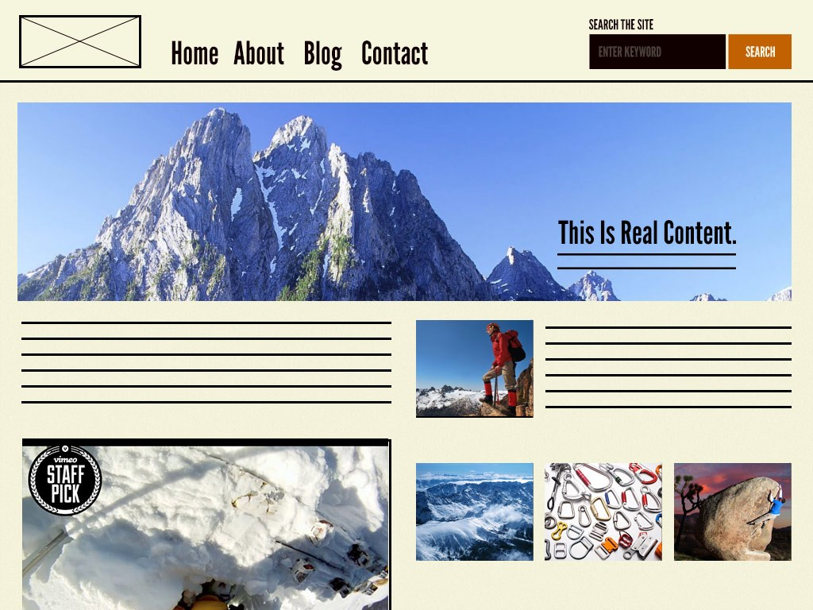

   As páginas também fornecem um local para articular variações em modelos, o que é crucial para estabelecer sistemas de design robustos e confiáveis.

**Vantagens em usar o Atomic Design**

- O design atômico se aplica a todas as interfaces de usuário, não apenas às baseadas na web.

- Uma das maiores vantagens que o design atômico oferece é a capacidade de alternar rapidamente entre o abstrato e o concreto.

- Com ele, temos a separação limpa entre estrutura e conteúdo.

  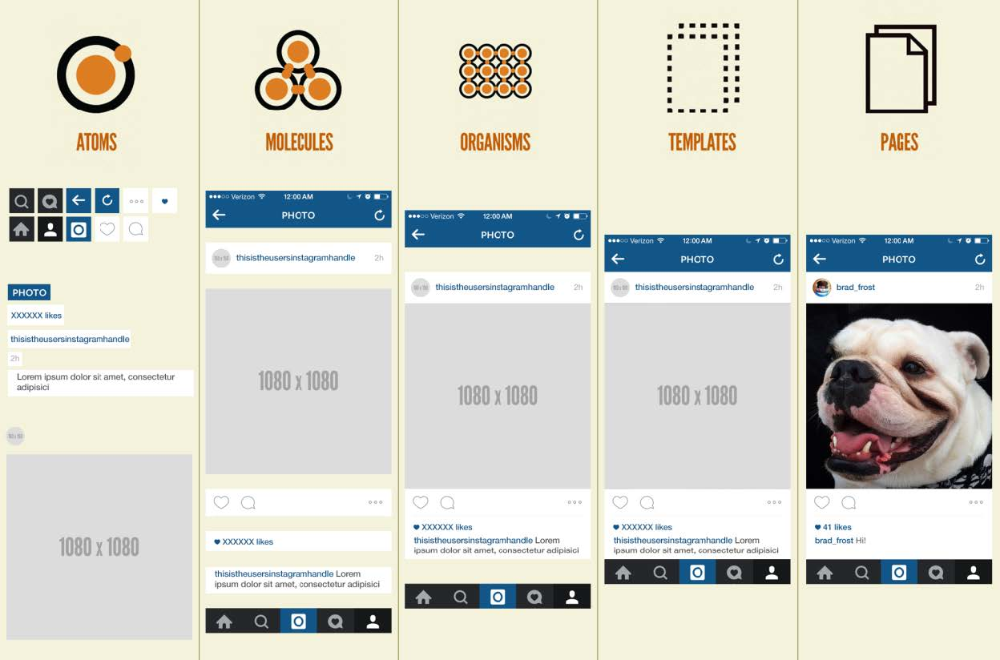
