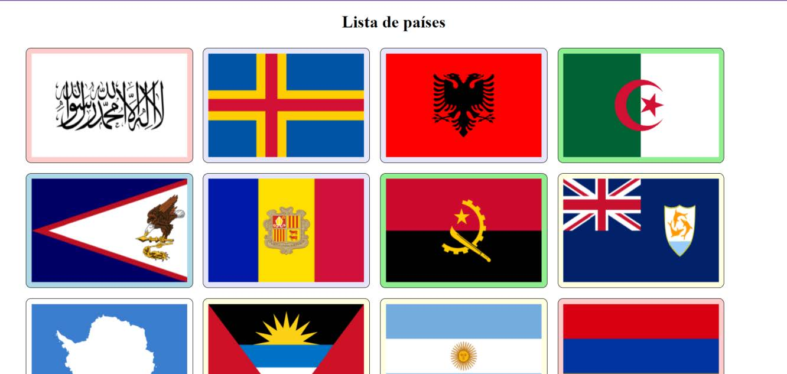

# Trabalho Prático do Módulo 1 - Design para Front-end

### Objetivo

O trabalho prático teve o objetivo de exercitar os seguintes conceitos trabalhados no Módulo:

1. HTML Semântico;
2. CSS Estilos e Animações;
3. Metodologias CSS;
4. Pseudoelementos e pseudoclasses;
5. CSS Pré-processadores;
6. Layout CSS Moderno.

---

### Enunciado

O objetivo deste trabalho foi desenvolver um site com o layout provido utilizando o que foi aprendido nas aulas, conforme solicitado abaixo:

- Semanticamente coerente de acordo com as regras do HTML semântico;
- Responsivo;
- Com as devidas animações pedidas.

O projeto feito em `HTML`, `SASS` e `JavaScript` puro (Vanilla), e foi usado Flexbox para organização do posicionamento do conteúdo.

---

### Atividades

Foi desempenhadas as seguintes atividades: 

1. Pegar os dados da API de países (https://restcountries.com/) usando `fetch()`;

2. Mostrar todos os países da lista em estilo de flip card, conforme design a seguir:

    

3. Os estilos foram feitos usando o SASS;

4. O design é responsivo, de forma a se adequar a telas pequenas;

5. Foi necessário criar as tags HTML e os seletores SASS para que eles se adequem à metodologia BEM
   (Block, Element, Modifier).
