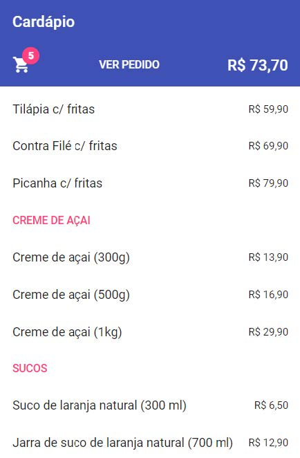
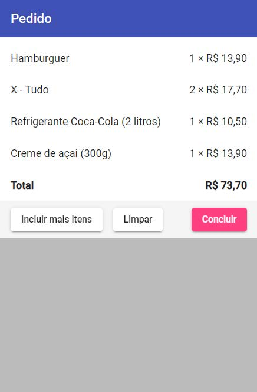

# Desafio do Módulo 2 - Angular

### Objetivo

O desafio teve o objetivo de exercitar os seguintes conceitos trabalhados no Módulo:

1. Criar componentes, templates e pipes;
2. Comunicar com o back end;
3. Definir roteamento;
4. Usar serviços;
5. Usar a biblioteca Angular Material.

---

### Enunciado

Construir, utilizando Angular, uma aplicação para pedido de comida, que vamos chamar de ngFood. Tal aplicação deve ter duas telas (cada uma com sua rota). 

A tela inicial, **Cardápio**, exibe a lista de produtos e seus respectivos preços. Ao clicar em um produto, ele deve ser adicionado ao pedido atual. Um produto pode ser adicionado repetidas vezes ao pedido, aumentando a quantidade dele. Essa tela também deve:

- Mostrar a quantidade de itens adicionados e o valor total do pedido atual.
- Ter um link para a tela **Pedido**.
- Exibir a categoria acima do produto quando ele não for da mesma categoria do anterior na lista (produtos da mesma categoria estão em sequência).

A tela Pedido exibe cada produto adicionado ao pedido atual e a respectiva quantidade, bem como o valor total do pedido. Essa tela deve ter botões para:

- Voltar para a tela Cardápio;
- Limpar o pedido (excluir todos os produtos);
- Concluir o pedido (não faz nada, apenas exiba o botão).

---

### Atividades

Para o desempenho do desafio, será necessário desempenhar as seguintes atividades:

1. Criar o projeto e adicionar a dependência para Angular Material;
2. Configurar o módulo principal da aplicação, adicionando `imports` para os módulos necessários, como `HttpClientModule`, módulos do Angular Material etc;
3. Criar os componentes para as duas telas;
4. Configurar rotas para cada tela;
5. Implementar o carregamento de dados (lembre-se de executar o back-end);
6. Implementar as funcionalidades descritas.

---

### Dicas

- Preocupar-se primeiro com a funcionalidade, deixe a aparência para o final;
- Nas interfaces demonstradas, e recomendado utilizar os componentes do Angular Material: `Toolbar, List`, `Button`, `Badge` e `Icon`;
- Definir uma interface Typescript descrevendo o formato dos objetos retornados pelo back-end.
- O json-server pode ser instalado com o comando `npm install -g json-server`. Para executar, e necessário usar o comando `json-server --watch nomeDoArquivo.json`.

---

### Resultado Final

Abaixo temos exemplos da interface da aplicação em diferentes situações. A aplicação final não precisa ter exatamente a mesma aparência do exemplo abaixo, basta ter o comportamento especificado.

No entanto, foi necessário cumprir às seguintes exigências:

- A lista de produtos deve ser obtida por meio de uma requisição HTTP a um back end fictício, baseado em `json-server`. Executar por meio do comando `json-server --watch cardapio.json`. O arquivo `cardapio.json` foi fornecido pelo professor no fórum de avisos. Note que o endpoint /cardapio retorna um array onde cada objeto possui os campos categoria, descricao e preco.
- Usar ao menos um componente da biblioteca Angular Material.
- Usar um serviço para armazenar e gerenciar os dados do pedido atual (que são globais).

Tela **Cardápio**:

  

Tela **Cardápio** após adicionar produtos:

 

Tela **Pedido**:

 

Tela **Pedido** após limpar:

 

