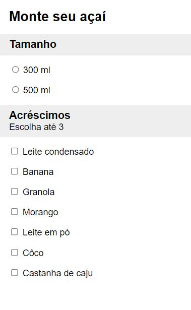
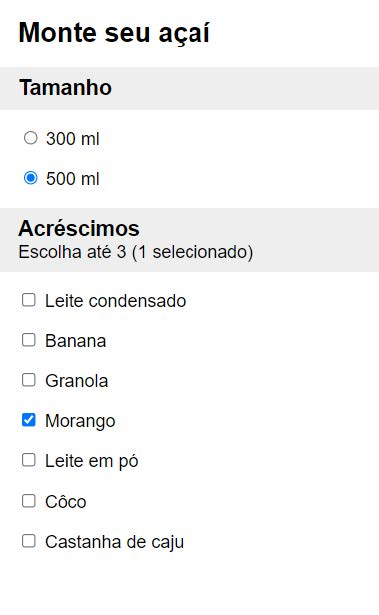
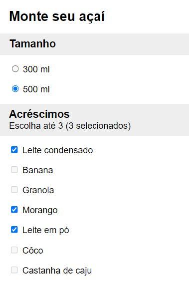

# Trabalho Prático do Módulo 2 - Angular

### Objetivo

Exercitar os seguintes conceitos trabalhados no Módulo:

1. Criar uma aplicação Angular;
2. Criar componentes e templates;
3. Utilizar data/event bindings;
4. Utilizar diretivas estruturais;
5. Estilizar componentes.

---

### Enunciado

Utilizando o Angular, construa um componente que permita a seleção de opções de uma lista predefinida. Tal componente deve ser configurável e receber como propriedades:

- Um título, exibido no topo do componente (string).
- A lista de opções disponíveis, na forma de um array de strings.
- A quantidade máxima de escolhas permitidas (number).

---

### Atividades

Para o desempenho do desafio, será necessário desempenhar as seguintes atividades:

1. Criar uma aplicação Angular com o nome desejado;
2. Adicionar na aplicação um componente `SelecaoComponent`;
3. Adicionar as input `properties` necessárias no `SelecaoComponent`, conforme especificado;
4. Você precisará de alguma propriedade no seu componente para armazenar o estado da interface, ou seja, as opções selecionadas. Uma opção é usar um `array` de `strings`;
5. Implementar os comportamentos exigidos no seu componente conforme especificado, lembrando de tratar tanto o caso de seleção única quando seleção múltipla;
6. Usar o componente `SelecaoComponent` ao menos duas vezes no componente principal;
7. Estilizar a aplicação da maneira que desejar, mas definir pelo menos uma regra no CSS global (arquivo styles.css) e uma regra no CSS específico do componente;

---

### Resultado Final

O resultado final deverá ficar conforme as imagens abaixo:

1. Interface no estado inicial:

   

2. Interface após selecionar uma opção:

   

3. Interface após selecionar todas as opções permitidas:

   
